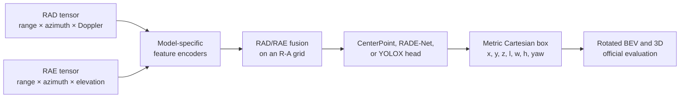

# Domain Shift in 4D Radar Object Detection

<p align="center">
  <strong>Paired RAD/RAE radar detection with metric Cartesian 3D boxes under weather and domain shift</strong>
</p>

<p align="center">
  
</p>

<p align="center">
  <sub>Qualitative detections across five weather domains. Camera views are shown above Cartesian radar views; ground truth is green and predictions are red.</sub>
</p>

This repository studies how 4D radar object detectors behave when the training and evaluation domains differ. It combines paired range–azimuth–Doppler (**RAD**) and range–azimuth–elevation (**RAE**) tensors, predicts metric Cartesian 3D boxes, and evaluates source-to-target transfer across weather conditions in K-Radar.

The codebase provides:

- seven current detector families with CenterPoint, RADE-Net, or YOLOX heads;
- fixed train/test manifests and generated controlled domain splits;
- source-domain and target-domain training workflows;
- official revised K-Radar BEV and 3D AP at IoU 0.3;
- distance-quartile analysis for locating where domain shift occurs;
- standalone checkpoint evaluation and radar/multi-sensor visualization.

## Research question

How much does detection performance change when a 4D radar detector is trained on one weather distribution and evaluated on another, and how does that change depend on detector architecture and object distance?

The main experiment compares two controlled training conditions for each target weather domain:

```text
source model: shared scenes + source-weather scenes
target model: shared scenes + target-weather scenes
evaluation:   the same held-out target-weather scenes
target delta: target-trained AP - source-trained AP
```

The repository contains controlled splits for heavy snow, light snow, overcast, rain, and sleet. It also supports equal-count ground-truth distance quartiles so that aggregate domain shift can be separated into near- and far-range behavior.

## Recorded domain-shift results

The following is a recorded Model7, Sedan-only domain-shift study from the local experiment outputs. Values are means over epochs 5–24 using complete source/target pairs. These historical study runs are separate from the current two-class checkpoint audit below.

| Target weather | Source BEV | Target BEV | BEV target delta | Source 3D | Target 3D | 3D target delta |
|---|---:|---:|---:|---:|---:|---:|
| Heavy snow | 39.9754 | 45.5840 | +5.6086 ± 4.7930 | 36.0194 | 40.3157 | +4.2963 ± 4.9431 |
| Light snow | 32.4615 | 35.5336 | +3.0721 ± 8.5934 | 27.3992 | 29.5986 | +2.1994 ± 9.0871 |
| Overcast | 18.5279 | 17.8341 | −0.6938 ± 2.6995 | 15.3616 | 13.7946 | −1.5671 ± 2.9820 |
| Rain | 37.7035 | 58.0472 | +20.3437 ± 8.3027 | 23.5772 | 39.5075 | +15.9303 ± 4.9101 |
| Sleet | 37.4580 | 49.2034 | +11.7455 ± 6.0154 | 17.8303 | 29.8514 | +12.0210 ± 1.8350 |

All AP values use the official revised K-Radar metric at IoU 0.3 and are reported in percentage points. A positive target delta means that target-domain training improved held-out target-domain performance. See [Domain-shift tables](docs/domain_shift_tables.md) for table generation and metadata rules.

## Models and verified checkpoints

The table below comes from an audit of locally available `global_best` checkpoints. Every listed checkpoint passed the current metadata validator and strict model-state loading. The best epoch is selected by official BEV mAP at IoU 0.3; 3D mAP is reported from that same checkpoint.

| Model | Architecture | Detection head | Variant | Best epoch | BEV mAP @ 0.3 | 3D mAP @ 0.3 |
|---|---|---|---|---:|---:|---:|
| Model7 | Separate Swin-FPN RAD/RAE encoders + fusion/refinement | CenterPoint | 64 hidden channels | 27 | 39.6604 | 32.9594 |
| Model7 | Separate Swin-FPN RAD/RAE encoders + fusion/refinement | CenterPoint | 128 hidden channels | 20 | 40.2879 | 33.2583 |
| Model7 | Separate Swin-FPN RAD/RAE encoders + fusion/refinement | RADE-Net | 64 hidden channels | 21 | 37.8140 | 29.8504 |
| Model8 | CFE-enhanced deformable FPN + RAD/RAE fusion | CenterPoint | 128 hidden channels | 24 | 50.1911 | 42.1128 |
| Model8 | CFE-enhanced deformable FPN + RAD/RAE fusion | RADE-Net | 128 hidden channels | 27 | 38.4476 | 29.8391 |
| Model12 | Deformable FPN + RAD/RAE fusion | CenterPoint | 128 hidden channels | 29 | 47.1138 | 39.7660 |
| Model12 | Deformable FPN + RAD/RAE fusion | RADE-Net | 128 hidden channels | 11 | 39.1329 | 31.6759 |
| Model13 | CBAM U-Net / RADE-Net backbone + dilated residual neck | CenterPoint | 128 hidden channels | 8 | 50.6806 | **44.7438** |
| Model13 | CBAM U-Net / RADE-Net backbone + dilated residual neck | RADE-Net | 128 hidden channels | 13 | **51.1765** | 43.6554 |
| Model14 | Lightweight Swin-FPN + RAD/RAE fusion | YOLOX decoupled head | 96 hidden channels | 26 | 35.6606 | 32.0466 |
| Model16 | Separate Swin-FPN RAD/RAE encoders + fusion | Official-style RADE-Net head | 128 hidden channels | 29 | 43.4143 | 36.1090 |

These runs use metric Cartesian boxes, two target classes (`Sedan` and `Bus or Truck`), seed 42, and the fixed K-Radar train/test manifests. Each run covers epochs 1–30. Checkpoint files are local artifacts and are not distributed in this repository.

Two local artifacts were intentionally excluded: an earlier Model7 run uses a superseded split contract, and a historical Model15 checkpoint does not strictly load into the current Model15 implementation. Their results are therefore not presented as current verified checkpoints.

## Detection pipeline



RAD tensors have shape `[B, 64, R, A]`, and RAE tensors have shape `[B, 37, R, A]`. Their shared range–azimuth feature grid is used to locate candidate cells. Box geometry, regression, matching, decoding, and evaluation use the canonical metric Cartesian representation:

```text
[x, y, z, length, width, height, yaw]
```

This separation lets the detector retain the natural radar grid while measuring object geometry directly in metres.

### Current detector support

| Model | CenterPoint | RADE-Net | YOLOX |
|---|:---:|:---:|:---:|
| Model7 | ✓ | ✓ | — |
| Model8 | ✓ | ✓ | — |
| Model12 | ✓ | ✓ | — |
| Model13 | ✓ | ✓ | — |
| Model14 | — | — | ✓ |
| Model15 | ✓ | ✓ | — |
| Model16 | — | ✓ | — |

Detailed architecture descriptions and the source-level support matrix are available in [models/model_description.md](models/model_description.md) and [models/model_experiment_matrix.md](models/model_experiment_matrix.md).

## Visualizations

The visualization workflow can render radar predictions by themselves or align them with camera and LiDAR data.

| Camera + Cartesian radar | Camera + LiDAR + radar |
|---|---|
|  |  |

<p align="center">
  
</p>

<p align="center"><sub>Predictions on a Cartesian range–azimuth map.</sub></p>

## Quick start

### 1. Create the environment

Python 3.10 is the current development target. Install a PyTorch build appropriate for your CUDA runtime, then install the remaining dependencies:

```bash
git clone https://github.com/xinyuzhangsofia-gif/new_rad_rae_object_detection.git
cd new_rad_rae_object_detection

conda create -n radar-domain-shift python=3.10 -y
conda activate radar-domain-shift
pip install -r requirements.txt
```

The pinned environment currently uses PyTorch 2.9 and CUDA 12.8 builds. GPU evaluation is recommended for the official rotated IoU backend; CPU execution remains useful for lightweight checks.

### 2. Configure the data

The code reads paths from [configs/data.py](configs/data.py). The existing environment-variable names are part of the configuration API:

```bash
export MVRSS_RADAR_ROOT=/path/to/paired_rad_rae_npy
export MVRSS_CARTESIAN_GT_ROOT=/path/to/cartesian_info_labels

# Required for multi-sensor visualization or raw K-Radar integration:
export MVRSS_RAW_KRADAR_ROOT=/path/to/raw_kradar
export MVRSS_KRADAR_TOOLS_ROOT=/path/to/kradar_tools
export MVRSS_OFFICIAL_KRADAR_GT_ROOT=/path/to/official_info_labels
export MVRSS_CAMERA_RGB_ROOT=/path/to/camera_images
export MVRSS_LIDAR2RADAR_CALIB_PATH=/path/to/lidar_to_radar_calibration.txt
```

The paired radar root is expected to contain sequence folders with aligned RAD and RAE arrays. Cartesian labels must cover the frames selected by the manifests in `data/manifests/kradar/`. The tracked split contains 17,458 training frames and 17,536 held-out test frames across the 58-sequence K-Radar catalog.

### 3. Train a detector

Set `model_type`, `loss_mode`, and runtime options in [configs/training.py](configs/training.py), then run:

```bash
python train.py
```

The normal and resume entrypoints share the same training workflow. To continue from a checkpoint, configure [configs/resume.py](configs/resume.py) and run:

```bash
python train_resume.py
```

Checkpoints are written under `checkpoints/`, and TensorBoard logs under `runs/`. The `global_best` artifact stores the epoch with the best configured selection metric, including epochs between regular checkpoint intervals.

### 4. Evaluate checkpoints

Configure [configs/evaluation.py](configs/evaluation.py), or override its public command-line options:

```bash
python evaluation.py \
  --checkpoint-root checkpoints/<run> \
  --start-epoch 1 \
  --end-epoch 30 \
  --official-eval-iou-backend auto
```

The standalone evaluator validates the current checkpoint contract, reconstructs the detector from checkpoint-owned identity, and applies evaluation-owned thresholds and output controls. Its primary metrics are official revised BEV and 3D AP at IoU 0.3.

### 5. Visualize predictions

Set paths and defaults in [configs/visualization.py](configs/visualization.py), then choose one of the four modes:

```bash
# Single Cartesian radar frame
python visualize.py --mode ra_map --ra-map-coordinate cartesian

# Camera + LiDAR + radar frame
python visualize.py \
  --mode multisensor \
  --sensor-layout camera_lidar_radar \
  --ra-map-coordinate cartesian

# Video variants: ra_map_video or multisensor_video
```

## Domain-shift experiments

The experiment queue under `scripts/experiments/` and `training/experiments/` supports reproducible source/target training across seeds 42, 43, and 44. Generated manifests live under `experiments/controlled_splits/` and keep target-domain evaluation fixed while changing the training domain.

The main experiment families are:

- **Target drop:** source-trained versus target-trained AP on held-out target weather.
- **Distance quartiles:** the same comparison within equal-count ground-truth distance bins.
- **Controlled splits:** reproducible shared/source/target scene membership for each weather domain and seed.

Historical source-drop and fixed distance-range outputs remain readable for scientific record keeping, while current runs use the target-drop and distance-quartile workflows.

## Evaluation protocol

- **Targets:** Sedan and Bus or Truck in the current two-class checkpoints.
- **Geometry:** metric Cartesian 3D boxes with rotated BEV overlap.
- **Primary metric:** official revised K-Radar BEV and 3D AP at IoU 0.3.
- **Ranking threshold:** the AP score threshold defaults to 0.01; the display/summary threshold does not replace AP ranking.
- **Ignored objects:** configured pedestrian, bicycle, and motorcycle categories can suppress spatial regions without becoming regression targets.
- **Optional analyses:** custom IoU sweeps, COCO-style metrics, nuScenes-style metrics, and distance quartiles are available but must not be mixed with the primary official AP columns.

## Repository map

```text
configs/         Training, evaluation, data, resume, and visualization settings
data/            Dataset, geometry, labels, collate logic, and fixed manifests
models/          Model7/8/12/13/14/15/16 implementations and factory
training/        Shared training loop, losses, checkpoints, and experiments
eval/            Decoding, inference, metrics, reports, and domain-shift tables
visualization/   Radar and multi-sensor rendering workflows
experiments/     Controlled splits and recorded scientific outputs
scripts/         Dataset preparation and experiment entrypoints
tests/           Current contract, geometry, loss, checkpoint, and workflow tests
docs/            Code guide and result-table documentation
```

For implementation details, see the [code guide](docs/code_guide.md).

## Reproducibility notes

- The fixed K-Radar manifests, class mapping, coordinate convention, and checkpoint metadata define the current experiment contract.
- Checkpoint results in this README were read directly from local artifacts and strict-loaded against the current source tree; the artifacts themselves are ignored and are not included in Git.
- The domain-shift summary is retained as recorded scientific output and is labeled separately because it belongs to an earlier Sedan-only experiment series.
- No result in this README was inferred from a filename alone.

## Acknowledgements

This project builds on the K-Radar dataset and official evaluation conventions. Please follow the dataset owners' terms and citation guidance when using K-Radar data.
