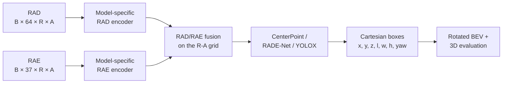

# 4D Radar Object Detection Model Zoo

> RAD/RAE-based 4D radar object detectors and a reproducible domain-shift experiment framework on K-Radar

This repository provides comparable 4D radar detector implementations, metric Cartesian 3D detection, official K-Radar evaluation, and an automated Source/Target experiment workflow for weather-domain studies.

<p align="center">
  
</p>

<p align="center"><sub>Camera and Cartesian radar detections across five K-Radar weather domains. Ground truth is green; predictions are red.</sub></p>

## What is included

- **Model Zoo:** Model7/8/12/13/14/15/16 with CenterPoint, RADE-Net, or YOLOX heads.
- **Paired radar input:** RAD and RAE tensors aligned on a range–azimuth feature grid.
- **Cartesian detection:** metric boxes in `[x, y, z, length, width, height, yaw]` format.
- **Reproducible evaluation:** official revised K-Radar BEV and 3D AP at IoU 0.3.
- **Domain-shift framework:** table-driven Source/Target training, fixed target tests, result writeback, and weather summaries.
- **Analysis tools:** controlled source splits, equal-count distance quartiles, checkpoint evaluation, and multi-sensor visualization.

## Model Zoo

The table below was rebuilt from local checkpoint payloads. For every retained run, all available epoch checkpoints were inspected. The selected epoch maximizes **official revised K-Radar BEV mAP at IoU 0.3**, and the 3D mAP comes from that same epoch. Every listed checkpoint also passes current metadata validation and strict state-dict loading.

| Model | Backbone / Encoder | Head | Hidden Ch. | Best Epoch | BEV mAP @ 0.3 | 3D mAP @ 0.3 | Checkpoint |
|---|---|---|---:|---:|---:|---:|---|
| Model7-CP-64 | Separate Swin-FPN RAD/RAE encoders + fusion | CenterPoint | 64 | 27 | 39.6604 | 32.9594 | Local only |
| Model7-CP-128 | Separate Swin-FPN RAD/RAE encoders + fusion | CenterPoint | 128 | 20 | 40.2879 | 33.2583 | Local only |
| Model7-RADE-64 | Separate Swin-FPN RAD/RAE encoders + fusion | RADE-Net | 64 | 21 | 37.8140 | 29.8504 | Local only |
| Model8-CP | CFE-enhanced deformable FPN + fusion | CenterPoint | 128 | 24 | 50.1911 | 42.1128 | Local only |
| Model8-RADE | CFE-enhanced deformable FPN + fusion | RADE-Net | 128 | 27 | 38.4476 | 29.8391 | Local only |
| Model12-CP | Deformable FPN + fusion | CenterPoint | 128 | 29 | 47.1138 | 39.7660 | Local only |
| Model12-RADE | Deformable FPN + fusion | RADE-Net | 128 | 11 | 39.1329 | 31.6759 | Local only |
| Model13-CP | CBAM U-Net + dilated residual neck | CenterPoint | 128 | 8 | 50.6806 | **44.7438** | Local only |
| Model13-RADE | CBAM U-Net + dilated residual neck | RADE-Net | 128 | 13 | **51.1765** | 43.6554 | Local only |
| Model14-YOLOX | Lightweight Swin-FPN + fusion | YOLOX | 96 | 26 | 35.6606 | 32.0466 | Local only |
| Model16-RADE | Separate Swin-FPN RAD/RAE encoders + fusion | Official-style RADE-Net | 128 | 29 | 43.4143 | 36.1090 | Local only |

AP values are shown in **percentage points**. These are two-class Cartesian runs (`Sedan` and `Bus or Truck`), seed 42, evaluated during training on the fixed K-Radar test manifest. Checkpoint binaries are ignored by Git and are not distributed yet; the final column is ready for future release links.

Model15 remains supported by current source code, but its available local checkpoint is historical: it passes metadata validation yet fails strict loading into the current Model15 because the saved architecture marker changed. It is therefore excluded from the verified Model Zoo results. An earlier Model7 run using the superseded `split_mode="file"` contract is also excluded. Models 1–6 and 9–11 remain historical/reference implementations and are outside the current Cartesian training contract.

### Supported detector heads

This matrix is derived from `training/configuration.py` and `models/factory.py` on this branch.

| Model | CenterPoint | RADE-Net | YOLOX |
|---|:---:|:---:|:---:|
| Model7 | ✓ | ✓ | — |
| Model8 | ✓ | ✓ | — |
| Model12 | ✓ | ✓ | — |
| Model13 | ✓ | ✓ | — |
| Model14 | — | — | ✓ |
| Model15 | ✓ | ✓ | — |
| Model16 | — | ✓ | — |

See [model descriptions](models/model_description.md) for architecture details and [the experiment matrix](models/model_experiment_matrix.md) for implementation and run status.

## Architecture overview



The range–azimuth grid locates feature cells and ignore regions. Box regression, matching, decoding, and evaluation use exact metric Cartesian geometry.

| Family | High-level design |
|---|---|
| Model7 | Swin-FPN RAD/RAE encoders with feature fusion |
| Model8 | Convolutional feature enhancement with deformable FPN |
| Model12 | Deformable FPN with RAD/RAE fusion |
| Model13 | CBAM U-Net backbone with a dilated residual neck |
| Model14 | Lightweight Swin-FPN with a decoupled YOLOX head |
| Model16 | Swin-FPN fusion with an official-style RADE-Net head |

## Quick start

### 1. Clone this branch

```bash
git clone --branch domain-shift-in-4d-radar-object-detection \
  https://github.com/xinyuzhangsofia-gif/new_rad_rae_object_detection.git
cd new_rad_rae_object_detection
```

### 2. Install dependencies

Python 3.10 is the current development target. Install a PyTorch build suitable for your CPU/CUDA runtime, then install the reference dependencies:

```bash
conda create -n radar-domain-shift python=3.10 -y
conda activate radar-domain-shift
pip install -r requirements.txt
```

`requirements.txt` records the existing Python 3.10 / PyTorch 2.9 environment. It is a reference environment, not a freshly verified cross-platform lockfile. The rotated GPU evaluator requires a compatible CUDA setup; use the CPU backend for lightweight validation.

### 3. Configure the data

Paths are centralized in [configs/data.py](configs/data.py).

Required for normal training and evaluation:

```bash
export MVRSS_RADAR_ROOT=/data/K-Radar-RAD
export MVRSS_CARTESIAN_GT_ROOT=/data/K-Radar-GT-cartesian-radar-v2
```

Required only by raw-data utilities or multi-sensor visualization:

```bash
export MVRSS_RAW_KRADAR_ROOT=/data/KRadar
export MVRSS_OFFICIAL_KRADAR_GT_ROOT=/data/KRadar_revised_visibility
export MVRSS_CAMERA_RGB_ROOT=/data/K-Radar-RGB
export MVRSS_LIDAR2RADAR_CALIB_PATH=/data/calibration/lidar2radar_calib.yml
export MVRSS_KRADAR_TOOLS_ROOT=/opt/K-Radar
```

The radar root contains paired `<sequence>/rad/<frame>.npy` and `<sequence>/rae/<frame>.npy` files. The Cartesian GT root contains the radar-aligned labels and manifests used by the fixed split in `data/manifests/kradar/`.

### 4. Select and train a model

Training is configuration-driven. Edit `TRAIN_CONFIG` in [configs/training.py](configs/training.py):

```python
"model_type": "model7",
"loss_mode": "centerpoint",
"model7_decoder_hidden_channels": "128",
"epochs": 30,
"batch_size": 8,
"lr": 5e-5,
"split_mode": "kradar_file",
```

Then run:

```bash
python train.py
```

`kradar_file` is the ordinary fixed-manifest split. Training and resume read configuration files rather than command-line arguments. To resume, configure [configs/resume.py](configs/resume.py) and run `python train_resume.py`.

### 5. Evaluate checkpoints

Set persistent defaults in [configs/evaluation.py](configs/evaluation.py), or use its CLI overrides:

```bash
python evaluation.py \
  --checkpoint-root checkpoints/object_detection/your_run \
  --start-epoch 1 \
  --end-epoch 30 \
  --official-eval-iou-backend auto
```

The evaluator reconstructs model identity from the checkpoint, loads the state dict strictly, decodes canonical Cartesian boxes, and evaluates the selected split.

### 6. Visualize predictions

Configure sensor roots in [configs/visualization.py](configs/visualization.py), then run one of the supported modes:

```bash
export CHECKPOINT_PATH=checkpoints/object_detection/your_run/checkpoint.pth

# Cartesian radar view
python visualize.py \
  --mode ra_map \
  --ra-map-coordinate cartesian \
  --checkpoint-path "$CHECKPOINT_PATH"

# Camera + LiDAR + radar
python visualize.py \
  --mode multisensor \
  --sensor-layout camera_lidar_radar \
  --ra-map-coordinate cartesian \
  --checkpoint-path "$CHECKPOINT_PATH"
```

Set `CHECKPOINT_PATH` to an actual `.pth` file from the chosen run. Checkpoints are not distributed in this repository.

## Reproducing the Domain Shift Protocol

The repository implements a paired experiment rather than comparing unrelated runs:

```text
SOURCE model: shared data + source-domain data
TARGET model: shared data + target-domain data

SOURCE evaluation ─┐
                   ├─> the exact same held-out target-domain test data
TARGET evaluation ─┘

TD = AP_target - AP_source
```

Keeping `test_seq` identical makes the Target Drop attributable to the training-domain change instead of a test-set change. Sequence groups must be disjoint, and target-test sequences stay held out from both training branches.

### Experiment-table fields

| Field | Used by source branch | Used by target branch | Meaning |
|---|:---:|:---:|---|
| `shared_seq` | ✓ | ✓ | Training data common to both models |
| `source_seq` | ✓ | — | Additional source-domain training data |
| `target_seq` | — | ✓ | Additional target-domain training data |
| `test_seq` | validation | validation | Identical held-out target-domain evaluation data |

Training sequence tokens may use `_first` or `_last`, for example `12_first` or `10_first,10_last`. The parser selects the chronological first or last half using `train_sequence_half_ratio` (0.5 by default). Both halves of the same sequence can be listed when the ratio is 0.5. Half-selection suffixes are rejected for `test_seq` because the test set must remain explicit and stable.

### Experiment-table format

The queue reads whitespace-aligned TXT or CSV files. Existing templates live in [experiments/target_drop](experiments/target_drop) for heavy snow, light snow, overcast, rain, and sleet.

```text
group   seed  shared_seq  source_seq  target_seq  test_seq  BEV_src  3D_src  BEV_tgt  3D_tgt  TD_BEV  TD_3D
group1  42    9           15,5        24,25       23        -        -       -        -       -       -
```

Metric cells may begin as `-`. A branch is complete only when both of its BEV and 3D cells contain results. A row with all four sequence fields set to `-` is treated as an unused template row. After both branches finish, the writer fills:

```text
TD_BEV = BEV_tgt - BEV_src
TD_3D  = 3D_tgt  - 3D_src
```

These are absolute AP-point differences. Positive values mean target-domain training performed better.

### Run the table-driven queue

Domain-shift training has one critical difference from ordinary training. Set this in `configs/training.py`:

```python
"split_mode": "sequence",  # required; kradar_file will raise an error
```

Then enable the queue in [configs/domain_shift.py](configs/domain_shift.py):

```python
"experiment_queue_enabled": True,
"experiment_sheet_paths": (
    "experiments/target_drop/heavy_snow_experiments.txt",
    "experiments/target_drop/light_snow_experiments.txt",
    "experiments/target_drop/overcast_experiments.txt",
    "experiments/target_drop/rain_experiments.txt",
    "experiments/target_drop/sleet_experiments.txt",
),
"experiment_queue_seed_order": (42, 43, 44),
"experiment_queue_branches": ("source", "target"),
"experiment_queue_skip_completed_branches": True,
"experiment_queue_update_sheet_results": True,
```

Start the normal entrypoint:

```bash
python train.py
```

For each seed, the current queue performs two phases:

```text
read pending rows across weather tables
        ↓
train source/target tasks in the configured worker pool
        ↓  (evaluation waits for every training task in this seed)
evaluate completed checkpoints on their common target test
        ↓
write BEV/3D results and absolute TD back to each table
        ↓
refresh per-weather and combined summaries
        ↓
continue with the next seed
```

Source and target jobs for a seed are independent tasks and may train concurrently. Completed branches are skipped when their two metric cells are already populated. Queue state and fresh evaluation-report metadata are used to associate results with the correct seed, sequence groups, half selections, and branch.

### Hardware configuration

The checked-in queue runtime in [configs/runtime.py](configs/runtime.py) targets three GPUs:

```text
3 isolated training workers on GPUs 0, 1, 2
9 evaluation workers across GPUs 0, 1, 2
up to 3 evaluations per GPU
evaluation batch size 32
```

Review these values before enabling the queue. Ordinary single-GPU training can use:

```python
TRAIN_RUNTIME_CONFIG = {
    "num_workers": 0,
    "gpu_ids": "0,",
    "post_training_eval_min_free_memory_mb": 4096,
}
```

and a smaller training `batch_size`. The full experiment queue intentionally requires parallel workers, so it has no universally safe serial single-GPU preset. On a one-GPU machine, use the single-pair workflow below. Standalone evaluation should also change `EVALUATION_RUNTIME_CONFIG["gpu_ids"]` and `cuda` from the checked-in multi-GPU values.

### Debug one Source/Target pair

To validate a new domain definition before launching the queue, disable the queue and configure one source run:

```python
# configs/training.py
"split_mode": "sequence",

# configs/domain_shift.py
"experiment_queue_enabled": False,
"domain_shift_train_branch": "source",
"shared_train_sequences": (9,),
"source_train_sequences": (15, 5),
"target_train_sequences": (24, 25),
"target_test_sequences": (23,),
```

Run `python train.py`. Then change only:

```python
"domain_shift_train_branch": "target",
```

and run it again. Both runs automatically derive `val_sequences=(23,)`. Keep the model, seed, test sequences, metric settings, and all non-domain training settings identical. This workflow is suitable for debugging; the table queue is the reproducible path for multi-weather, multi-seed result writeback.

### Optional controlled source split

Set `train_control_split_enabled=True` to reduce selected source/target differences in object-count and distance-bin composition. The code pairs source sequences (`controlled_sequences`) with target references (`reference_sequences`), generates or reuses artifacts under `experiments/controlled_splits/`, and filters the **source branch only**. The target branch always uses its original unfiltered data and rejects controlled-split activation.

The generated directory contains `train.txt`, `test.txt`, `object_ignore_override.json`, configuration, statistics, and a comparison report. This mechanism controls selected composition variables; it does not make the two domains identical.

### Distance-quartile evaluation

After the canonical rain/sleet Source/Target checkpoints exist, re-evaluate them by equal-count GT distance rank:

```bash
# Validate discovery without launching evaluation
python scripts/experiments/evaluate_quartile_experiments.py \
  --gpus 0 \
  --max-workers 1 \
  --max-per-gpu 1 \
  --batch-size 8 \
  --dry-run

# Run the checkpoint-only analysis
python scripts/experiments/evaluate_quartile_experiments.py \
  --gpus 0 \
  --max-workers 1 \
  --max-per-gpu 1 \
  --batch-size 8
```

This tool does **not** retrain. It discovers completed source/target checkpoints through the original target-drop queue state, evaluates the same held-out target data, derives Q1–Q4 from GT radar-center distance rank, and compares both branches inside the same quartile bounds.

The distance report uses two related quantities:

- overall `TD`: absolute AP points, `AP_target - AP_source`;
- Q1–Q4 relative drop: `100 × (AP_target - AP_source) / AP_target` percent.

A positive relative value means the source-trained model lost performance relative to the target-trained model. Current quartiles are equal-count GT groups, not fixed metric-distance bins. See the [distance-quartile output contract](experiments/distance_quartiles/README.txt) for the recorded format.

### Recorded weather-domain example

The local recorded summary below belongs to a historical **Model7 Sedan-only** experiment series. It averages official AP over epochs 5–24 for complete Source/Target pairs and is separate from the two-class Model Zoo ranking.

| Target weather | Source BEV | Target BEV | TD BEV | Source 3D | Target 3D | TD 3D |
|---|---:|---:|---:|---:|---:|---:|
| Heavy snow | 39.9754 | 45.5840 | +5.6086 ± 4.7930 | 36.0194 | 40.3157 | +4.2963 ± 4.9431 |
| Light snow | 32.4615 | 35.5336 | +3.0721 ± 8.5934 | 27.3992 | 29.5986 | +2.1994 ± 9.0871 |
| Overcast | 18.5279 | 17.8341 | −0.6938 ± 2.6995 | 15.3616 | 13.7946 | −1.5671 ± 2.9820 |
| Rain | 37.7035 | 58.0472 | +20.3437 ± 8.3027 | 23.5772 | 39.5075 | +15.9303 ± 4.9101 |
| Sleet | 37.4580 | 49.2034 | +11.7455 ± 6.0154 | 17.8303 | 29.8514 | +12.0210 ± 1.8350 |

See [domain-shift table documentation](docs/domain_shift_tables.md) for report matching and aggregation rules.

## Qualitative results

| Camera + Cartesian radar | Camera + LiDAR + radar |
|---|---|
|  |  |

<p align="center">
  
</p>

## Evaluation protocol

- **Primary Model Zoo metric:** official revised K-Radar BEV and 3D AP at IoU 0.3.
- **Current Model Zoo targets:** Sedan and Bus or Truck.
- **Geometry:** metric Cartesian 3D boxes and rotated BEV overlap.
- **AP score threshold:** 0.01 by default; `score_thresh=0.3` affects TP/FP/FN summaries, not AP ranking.
- **Ignored regions:** configured pedestrian, bicycle, and motorcycle categories can suppress regions without becoming training targets.
- **Optional metrics:** custom-IoU, COCO-style, nuScenes-style, and distance-quartile results are kept separate from the primary Model Zoo columns.

## Repository structure

```text
configs/                 Data, training, runtime, evaluation, and experiment settings
data/                    Dataset, Cartesian labels, geometry, manifests, controlled splits
models/                  Model implementations, factory, and architecture documentation
training/                Shared loops, losses, checkpointing, resume, experiment queue
eval/                    Decoding, inference, official metrics, reports, domain summaries
experiments/target_drop/ Source/Target experiment tables
experiments/distance_quartiles/
                         Recorded equal-count distance analysis
experiments/controlled_splits/
                         Generated distribution-control artifacts
scripts/experiments/     Experiment and post-training analysis entrypoints
visualization/           Radar, camera, LiDAR, and video workflows
tests/                   Contract, numerical, queue, evaluation, and visualization tests
docs/                    Detailed code and reporting guides
```

For implementation-level orientation, see the [code guide](docs/code_guide.md).

## Reproducibility notes

- Model Zoo metrics come from current-compatible local checkpoints and their stored official validation metrics, not filenames or historical tables.
- Every retained run was checked across all available epochs; `global_best` matched the maximum official BEV mAP@0.3 in each case.
- Model Zoo and historical domain-shift results use different experiment populations and are intentionally presented separately.
- Fixed manifests, table rows, seed, half selections, branch identity, checkpoint metadata, and evaluation reports together define one reproducible run.
- Checkpoints, runtime queue state, TensorBoard logs, and generated evaluation outputs are local artifacts unless explicitly tracked under `experiments/`.

## Tests

Run the CPU-safe suite with:

```bash
CUDA_VISIBLE_DEVICES= python -B -m unittest discover -s tests -q
```

Some tests skip when CUDA extensions, datasets, or optional local resources are unavailable. Training and full evaluation require the configured K-Radar data.

## Acknowledgements

This project builds on the K-Radar dataset and its official evaluation conventions. Follow the dataset authors' license, terms, and citation guidance when using K-Radar data.
