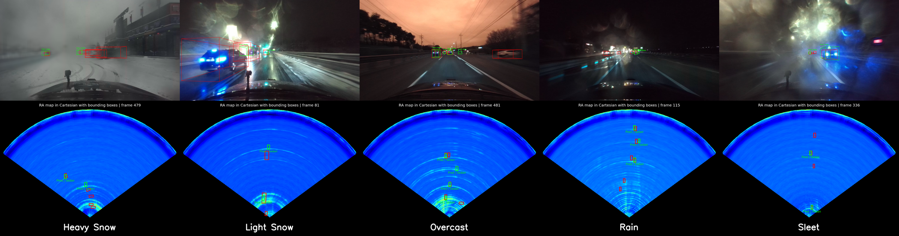
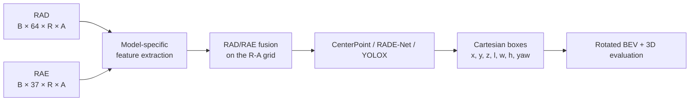
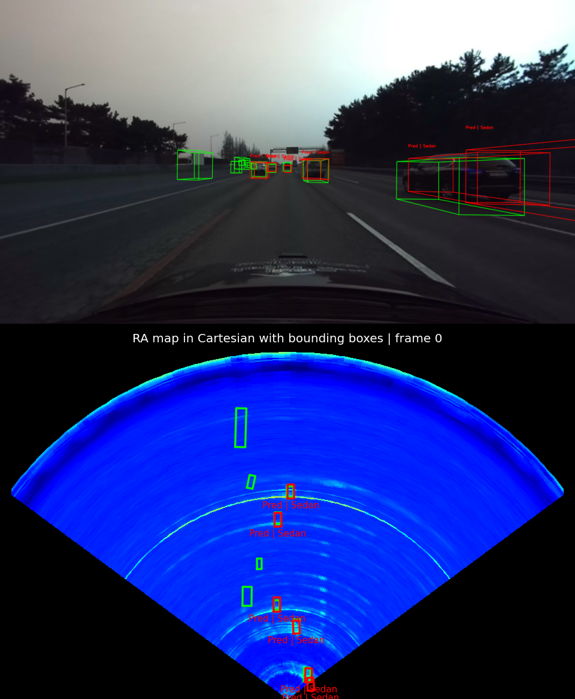
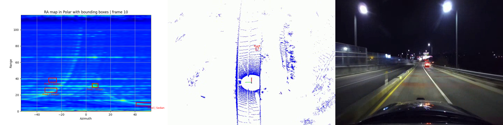
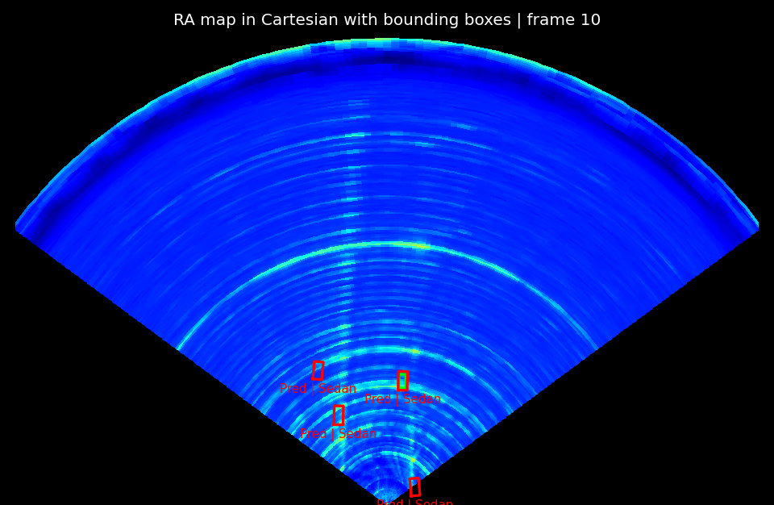

# 4D Radar Object Detection Model Zoo

> RAD/RAE-based 4D radar object detectors and a reproducible domain-shift experiment framework on K-Radar

This repository provides comparable 4D radar detectors, metric Cartesian 3D detection, official K-Radar evaluation, and a controlled Source/Target workflow for weather-domain studies.

<p align="center">
  
</p>

<p align="center"><sub>Camera and Cartesian radar detections across five K-Radar weather domains. Ground truth is green; predictions are red.</sub></p>

## Highlights

- Paired RAD and RAE radar representations on a range–azimuth feature grid.
- Model7/8/12/13/14/15/16 with CenterPoint, RADE-Net, or YOLOX heads.
- Model-specific configuration presets linked directly from the Model Zoo.
- Metric Cartesian boxes in `[x, y, z, length, width, height, yaw]` format.
- Official revised K-Radar BEV and 3D evaluation.
- Reproducible Domain Shift experiments with controlled-source and distance-quartile analysis.

## Model Zoo

The selected epoch maximizes **official revised K-Radar BEV mAP at IoU 0.3**; 3D mAP is reported from that same epoch. Retained checkpoints pass current metadata validation and strict state-dict loading.

**Common input:** `RAD [B, 64, R, A]` and `RAE [B, 37, R, A]`

**Common output:** Cartesian 3D boxes `[x, y, z, length, width, height, yaw]`

| Model | Backbone / Encoder | Head | Params | Best Epoch | BEV mAP @ 0.3 | 3D mAP @ 0.3 | Config | Checkpoint |
|---|---|---|---:|---:|---:|---:|---|---|
| Model7-CP-64 | Separate Swin-FPN RAD/RAE encoders + fusion | CenterPoint | 6.62 M | 27 | 39.6604 | 32.9594 | [config](configs/models/model7_centerpoint_64.py) | Local only |
| Model7-CP-128 | Separate Swin-FPN RAD/RAE encoders + fusion | CenterPoint | 6.88 M | 20 | 40.2879 | 33.2583 | [config](configs/models/model7_centerpoint_128.py) | Local only |
| Model7-RADE-64 | Separate Swin-FPN RAD/RAE encoders + fusion | RADE-Net | 6.73 M | 21 | 37.8140 | 29.8504 | [config](configs/models/model7_radenet_64.py) | Local only |
| Model8-CP | CFE-enhanced deformable FPN + fusion | CenterPoint | 6.44 M | 24 | 50.1911 | 42.1128 | [config](configs/models/model8_centerpoint.py) | Local only |
| Model8-RADE | CFE-enhanced deformable FPN + fusion | RADE-Net | 6.88 M | 27 | 38.4476 | 29.8391 | [config](configs/models/model8_radenet.py) | Local only |
| Model12-CP | Deformable FPN + fusion | CenterPoint | 4.91 M | 29 | 47.1138 | 39.7660 | [config](configs/models/model12_centerpoint.py) | Local only |
| Model12-RADE | Deformable FPN + fusion | RADE-Net | 5.35 M | 11 | 39.1329 | 31.6759 | [config](configs/models/model12_radenet.py) | Local only |
| Model13-CP | CBAM U-Net + dilated residual neck | CenterPoint | 27.89 M | 8 | 50.6806 | **44.7438** | [config](configs/models/model13_centerpoint.py) | Local only |
| Model13-RADE | CBAM U-Net + dilated residual neck | RADE-Net | 28.34 M | 13 | **51.1765** | 43.6554 | [config](configs/models/model13_radenet.py) | Local only |
| Model14-YOLOX | Lightweight Swin-FPN + fusion | YOLOX | 3.14 M | 26 | 35.6606 | 32.0466 | [config](configs/models/model14_yolox.py) | Local only |
| Model16-RADE | Separate Swin-FPN RAD/RAE encoders + fusion | Official-style RADE-Net | 7.32 M | 29 | 43.4143 | 36.1090 | [config](configs/models/model16_radenet.py) | Local only |

AP values are percentage points. These are two-class Cartesian runs (`Sedan` and `Bus or Truck`), seed 42, on the fixed K-Radar test manifest. Checkpoint binaries are local and are not distributed through Git.

Model15 is supported through [CenterPoint](configs/models/model15_centerpoint.py) and [RADE-Net](configs/models/model15_radenet.py) presets, but its available checkpoint is historical and incompatible with the current architecture marker, so it is excluded from verified results. Models 1–6 and 9–11 remain historical/reference implementations.

| Model | CenterPoint | RADE-Net | YOLOX |
|---|:---:|:---:|:---:|
| Model7 | ✓ | ✓ | — |
| Model8 | ✓ | ✓ | — |
| Model12 | ✓ | ✓ | — |
| Model13 | ✓ | ✓ | — |
| Model14 | — | — | ✓ |
| Model15 | ✓ | ✓ | — |
| Model16 | — | ✓ | — |

See [model descriptions](models/model_description.md) and the [model experiment matrix](models/model_experiment_matrix.md) for implementation details and evidence.

## Architecture Overview



The R-A grid locates feature cells and ignore regions; regression, matching, decoding, and evaluation use metric Cartesian geometry. Detailed model structure is documented in [models/model_description.md](models/model_description.md).

## Quick Start

1. **Clone this branch.**

   ```bash
   git clone --branch domain-shift-in-4d-radar-object-detection \
     https://github.com/xinyuzhangsofia-gif/new_rad_rae_object_detection.git
   cd new_rad_rae_object_detection
   ```

2. **Install the reference environment.** Python 3.10 is the current development target.

   ```bash
   conda create -n radar-domain-shift python=3.10 -y
   conda activate radar-domain-shift
   pip install -r requirements.txt
   ```

3. **Configure K-Radar paths.**

   ```bash
   export KRADAR_RADAR_ROOT=/path/to/K-Radar-RAD
   export KRADAR_CARTESIAN_GT_ROOT=/path/to/cartesian-radar-labels
   ```

   Raw sensor visualization may additionally use `KRADAR_RAW_ROOT`, `KRADAR_OFFICIAL_GT_ROOT`, `KRADAR_CAMERA_RGB_ROOT`, `KRADAR_LIDAR2RADAR_CALIB_PATH`, and `KRADAR_TOOLS_ROOT`. Legacy `MVRSS_*` variables remain accepted as deprecated aliases.

4. **Select a model preset** near the top of [configs/training.py](configs/training.py).

   ```python
   from configs.models.model7_centerpoint_128 import (
       MODEL_CONFIG as SELECTED_MODEL_CONFIG,
   )
   ```

5. **Train or resume.**

   ```bash
   python train.py
   # Configure configs/resume.py before resuming:
   python train_resume.py
   ```

   Training supports one GPU and PyTorch DistributedDataParallel. See [docs/training.md](docs/training.md) for batch semantics, DDP, resume, and hardware validation.

6. **Evaluate checkpoints.** Configure [configs/evaluation.py](configs/evaluation.py), then run:

   ```bash
   python evaluation.py --checkpoint-root checkpoints/object_detection/your_run
   ```

7. **Visualize predictions.** Configure [configs/visualization.py](configs/visualization.py), then run:

   ```bash
   python visualize.py --mode ra_map --ra-map-coordinate cartesian \
     --checkpoint-path checkpoints/object_detection/your_run/checkpoint.pth
   ```

## Domain Shift Evaluation

Source and Target models use the same selected model preset, optimization settings, seed, and held-out target test split. Only their domain-specific training data changes.

```text
Source: shared + source-domain training ─┐
                                         ├─ evaluate on the same target test split
Target: shared + target-domain training ─┘
                                         ↓
                     Target Drop = AP_target - AP_source
```

The table-driven queue manages weather definitions, Source/Target branches, seeds, checkpoint evaluation, result writeback, and summaries. Optional workflows provide controlled-source training and distance-quartile analysis of relative Target Drop. See [docs/domain_shift.md](docs/domain_shift.md) for the full protocol and commands.

## Qualitative Results

| Camera + Cartesian radar | Camera + LiDAR + radar |
|---|---|
|  |  |

<p align="center">
  
</p>

## Evaluation Protocol

Model Zoo entries use metric Cartesian boxes, rotated BEV overlap, and official revised K-Radar BEV/3D AP at IoU 0.3 for `Sedan` and `Bus or Truck`. Optional custom-IoU, COCO-style, nuScenes-style, and distance-quartile metrics remain separate from the primary table. See the [code guide](docs/code_guide.md) for evaluation internals.

## Repository Structure

```text
configs/        Data, model presets, training, runtime, and evaluation settings
data/           Datasets, Cartesian labels, geometry, and split manifests
models/         Detector implementations and architecture documentation
training/       Training loops, losses, checkpoints, resume, and experiment queue
eval/           Decoding, inference, metrics, reports, and domain summaries
experiments/    Target Drop tables, distance analysis, and controlled splits
visualization/  Radar, camera, LiDAR, and video workflows
docs/           Detailed user and implementation guides
tests/          Numerical, workflow, evaluation, and infrastructure tests
```

## Documentation

- [Domain Shift guide](docs/domain_shift.md) — experiment tables, queue execution, controlled splits, and distance analysis.
- [Training guide](docs/training.md) — single-GPU training, DDP, resume, and multi-GPU validation.
- [Code guide](docs/code_guide.md) — repository architecture and implementation responsibilities.
- [Model experiment matrix](models/model_experiment_matrix.md) — per-model support and verified run evidence.
- [Experiment families](experiments/README.md) — tracked experiment directory layout.
- [Domain-shift table reports](docs/domain_shift_tables.md) — automatic comparison-table output contract.

## Tests

```bash
CUDA_VISIBLE_DEVICES= python -B -m unittest discover -s tests -q
```

The suite includes a real two-process CPU/Gloo DDP smoke test. Dataset, CUDA-extension, and optional-resource tests may skip when those resources are unavailable.

## Acknowledgements

This project builds on the K-Radar dataset and its official evaluation conventions. Follow the dataset authors' license, terms, and citation guidance when using K-Radar data.
